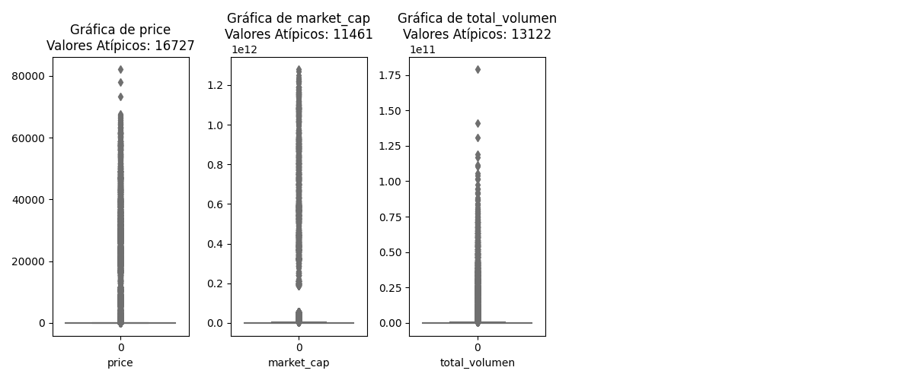
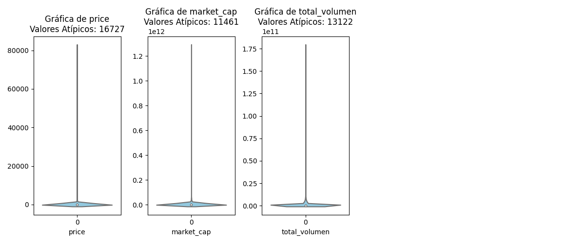
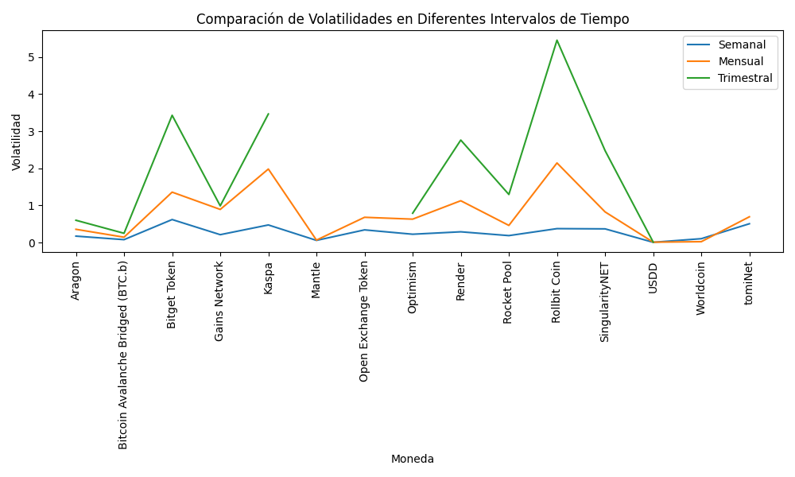
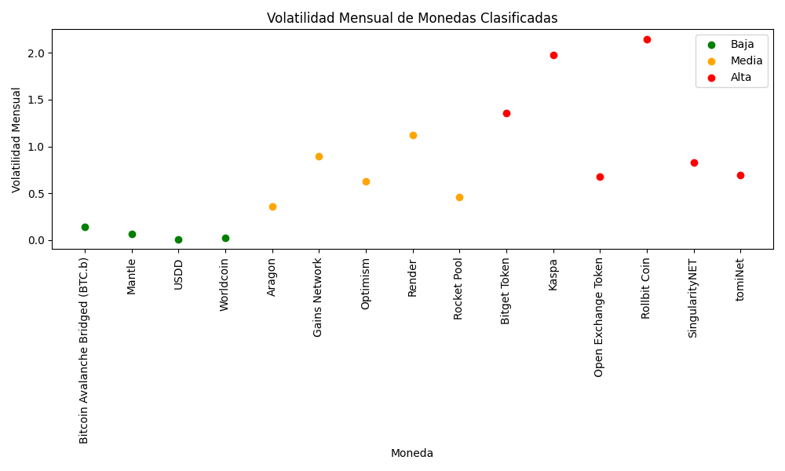
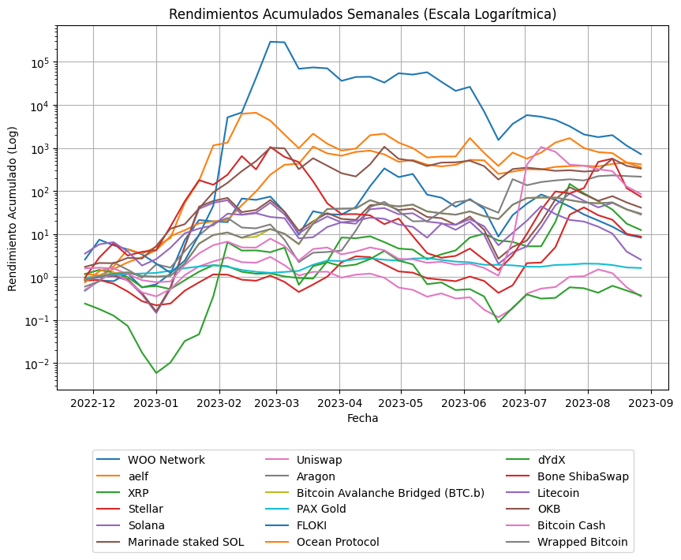
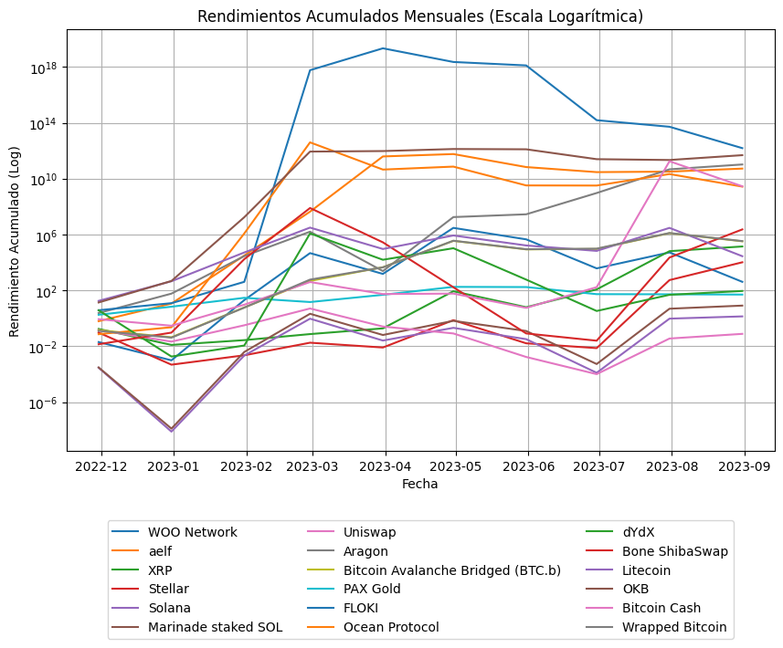
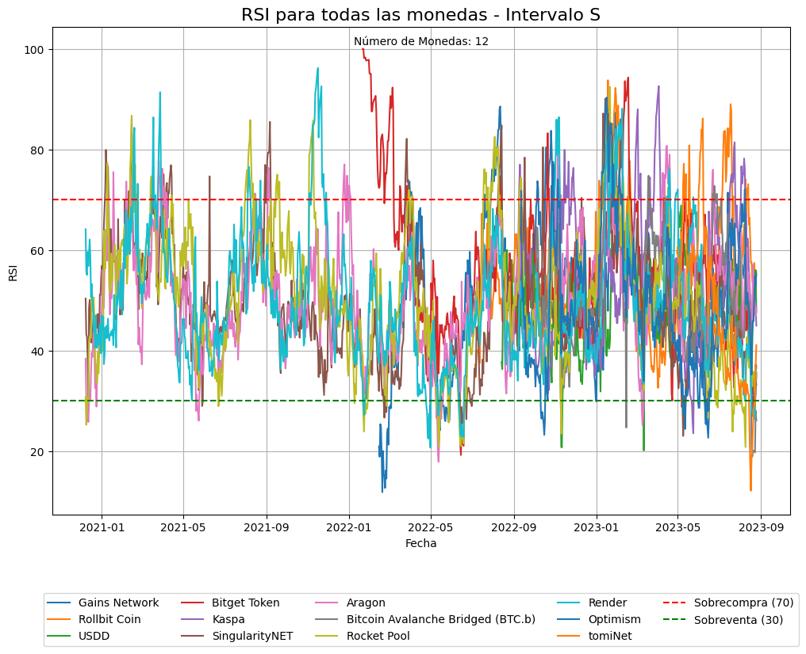
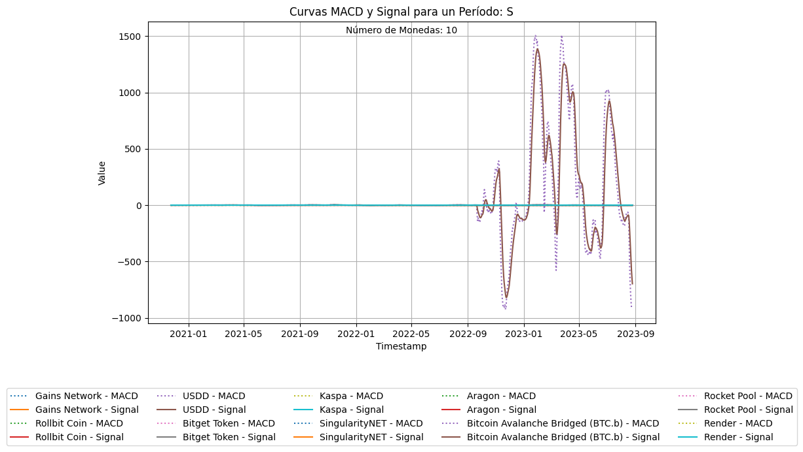
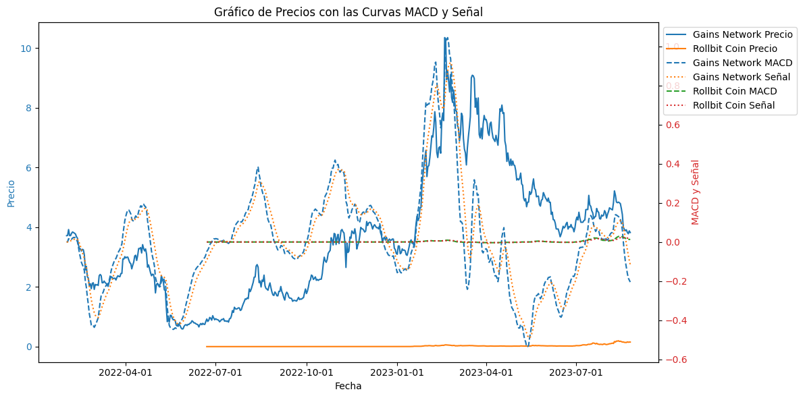

# <h1 align=center>**`Machine Learning (MLOps)`**</h1>

<h1 align="center">
  @autor: Lesmen Gerardo García Pernia  
  <a href="https://github.com/lesmengp/ProyectoCriptomonedas.git">GitHub: https://github.com/lesmengp/ProyectoCriptomonedas.git</a>  
  <a href="https://drive.google.com/drive/folders/1FCLUNAPYEfi854cBu4PZ1FGXKuy0KZAj?usp=sharing">Drive: https://drive.google.com/drive/folders/1c1wGdo7MV3T0YunNszSdCpvz-mNldwBw?usp=drive_link</a>  
 
</h1>

# <h1 align=center> ***Cryptocurrency Market Data Analytics*** </h1>

# <h1 align=center> **`PROYECTO INDIVIDUAL Nº2`** </h1>

Pagina principal de CoinGecko: 
https://https://www.coingecko.com/ 

### Objetivos Principal del Proyecto:  
-  Realizar un análisis en el mercado de Criptomonedas a traves de los datos de la API de CoinGeckco. 

### Objetivo General: 
-  Realizar un análisis en el mercado de Criptomonedas para identificar oportunidades de inversión a Mediano Plazo.

### Objetivo Específicos: 
1. Evaluar el rendimiento acumulado de las monedas en un período de tiempo específico.  
2. Identificar monedas sobrecompradas o sobrevendidas en un período de tiempo específico. 
3. Realizar seguimiento de cambios en la fuerza de la tendendia de las monedas.  
4. Identificar cruces de linea de señal para identificar cambios potenciales en la tendencia de las monedas. 
5. Analizar la divergencia entre las curvas MACD y Señal con respecto al precio de las monedas.  
  

### Alcance del Objetivo:
1. Horizonte Temporal:  
    - El horizonte temporal se refiere al período durante el cual se tomarán decisiones de inversión. En nuestro caso, nos estaremos enfocando en oportunidades de inversión a Mediano Plazo, en el mercado de las criptomonedas.
2. Seleccionar las Métricas Básicas:
    - Precio.
    - Capitalización de Mercado.
    - Volumen de Negociación Diario.
    - Variables OHLC.
3. Identificar patrones de movimientos en los precios en períodos diarios, semanales, mensuales y trimestrales.
    - Se examinarán patrones técnicos y gráficos que puedan proporcionar pistas sobre posibles movimientos de precios en el mediano Plazo.
4. Elegir KPIs efectivas para el analisis a corto plazo y mediano plazo: 
        - Indicador de Fuerza Relativa (RSI)
        - Indicador de Convergencia / Divergencia de Medidas Móviles (MACD)
        - Moving Average (Media Móvil)

### Estructura del Directorio de Trabajo:
+    En el directorio se hancreado 6 carpetas que contienen los siguientes archivos:
- src: 
    - En esta carpeta, se encuentran las imagenes que han sido colocadas en el archivo README.
- DataSets: 
    - En esta carpeta se encuentran los archivos CSV con las Variables y Monedas Seleccionadas para el Análisis de Datos. Dichos archivos seran cargados desde el EDA, para sus respectivos aálisis.
- DataSets/Datos:
    - Contiene los datos a subir a PowerBi    
- ETL: 
    - En esta carpeta se encuentra el archivo Notebook con la Extracción, Transformación y Carga (ETL)
- EDA: 
    - En esta carpeta se encuentra el archivo Notebook con el Análisis Exploratorios de los Datos (EDA).
- README: 
    - En esta carpeta se encuentra el archivo README donde se detalla todo lo realizado en el presente Proyecto.
- Requirements: 
    - En esta carpeta se encuentra un archivo llamado 'requirements.txt', con las librerias utilizadas y sus correspondientes versiones.

### Versiones de las librerias utilizadas 
+   pandas==1.3.5 
+   numpy==1.24.3 
+   pip==23.2.1 
+   typing-extensions==4.5.0 
+   uvicorn==0.20.0 
+   scikit-learn==1.0.2 
+   regex==2023.5.5 
+   matplotlib==3.7.1 
+   seaborn=0.12.2 
+   requests==2.31.0 
+   pycoingecko==3.1.0 

# Inicio del Proyecto!!!

# Índice
1. [Extracción Transformación y Carga (ETL)](#sección-1)
2. [Analisis Exploratorios de los Datos (EDA)](#sección-2)
3. [KPIs](#sección-3)
4. [Conclusiones](#sección-4)
5. [Dashboard](#sección-5)
6. [Diccionario de Términos](#sección-6)

## Sección 1
## 1. Extracción Transformación y Carga (ETL)

### Fuente de datos
+ [API CoinGecko](https://www.coingecko.com/es/api/documentation):  Sitio Web oficial de CoinGecko para el acceso a información de Criptomonedas a través de su API.

### 1.1. Selección de las Criptomonedas.
Se estarán seleccionando primeramente el 10% de las Criptomonedas existente en CoinGecko (más de 10.000 monedas), bajo el criterio principal de mayor Capitalización de Mercado y luego bajo el criterio secundario de mayor Volumen de Negociación. 
Luego de las primeras 100 Criptomonedas ordenadas por dichos criterios; se procede a seleccionar aleatoriamente, las 10 Criptomonedas para el análisis respectivo del presente proyecto: 

1. Se obtiene el total de Monedas en CoinGecko.
2. Se establece el porcentaje de Monedas a seleccionar. Inicialmente el 10 %.
3. Se obtiene el listado de Criptomonedas Ordenadas por Capitalización de Mercado.
4. Luego el Listado anterior se ordena nuevamente por el Volumen de Negociación y se selecciona las primeras 200 Monedas.
5. Y finalmente de las primeras 200 Monedas, se seleccionan aleatoriamente, 100 Monedas a ser analizadas: 

### 1.2. Carga de Datos desde CoinGecko.
Se procede a realizar la carga de los datos históricos de 3 años, de las variables de las Monedas Seleccionadas.

1.  Obteniendo el Historial de la Métrica: Precio Diario
2.  Obteniendo el Historial de la Métrica: Capitalización de Mercado Diario
3.  Obteniendo el Historial de la Métrica: Volumen de Negociación Diario.
4.  Se procede a unir los tres datasets en un solo Dataframe.

## Sección 2
## 2. Analisis Exploratorios de los Datos (EDA).

+   Selección de Monedas.

Se estarán seleccionando primeramente el 10% del total de las Criptomonedas existente en CoinGecko (más de 10.012 monedas), bajo el criterio principal de mayor Capitalización de Mercado y luego bajo el criterio secundario de mayor Volumen de Negociación. 
Luego de las primeras 200 Criptomonedas ordenadas por ambos criterios; se procederá a seleccionar 100 monedas aleatoriamente, con las cuales comenzaremos el análisis respectivo.  

Total de Monedas Seleccionadas Inicialmente: 100

### 2.1. Procesamiento de Datos.

### 2.1.1. Análisis de Valores Faltantes.

+   Se encuentran 100 valores nulos; uno en cada moneda, en el primer registro de la columna 'Open'. Esto es normal, ya que no existe fecha precio de apertura para el primer dia seleccionado. Siempre va a estar en blando.   Por tal razon, Se procede a Imputar por el promedio de las tres columnas de 'High', 'Low' y 'Close'.

### 2.1.2. Análisis de Valores Outliers.

+   En el siguiente gráfico de Cajas o Bigotes, se puede observar que el espacio de las cajas es practicamente una linea.   Esto significa que la media, mediana y los cuartiles estan muy agrupados en una parte del rango:

+   Cuando observamos las gráficas de Violin, podemos notar que existe mucha simetría.<Be> La razón principal es que todos los valores estan muy concentrados en un tramo específico del rango. Y como estamos hablando del Precio, es muy probable que sea característico del modelo de las Criptomonedas:

+   La gran simetría de las gráficas paraceira indicar que sigue una distribucion normal, pero es precisamente por la agrupación de los datos.

### 2.1.3. Análisis de Correlaciones.

+   Se pudo observar solo dos variables que presentan una correlacion positiva moderada alta de 0.77, entre 'total_volumen' y 'market_cap'. De hecho son las variables iniciales que se tomaron la la selección de monedas.   Las variales 'price', 'Open', 'High', 'Low', 'Close' tienen correlación iagual a 1, ya que se refiere practicamente a la misma variable del precio (sus variaciones son minímas).

### 2.1.4. Análisis de Tendencias Temporales.

1.   Conversión de la columna 'timestamp' a formato fecha. Despúes de realizar la conversión a formato fecha aparecen valores nulos en la columna 'timestamp'. Dada la relevancia de las fechas, se procede a eliminar todas las monedas que presentan valores nulos en la columna 'timestamp'.

2.  Análisis de monedas con tendencias a la baja.   Se procede a eliminar todas las monedas con tendencia a la baja en las últimas 8 semanas ( 2 meses).

### 2.1.5. Análisis de Volatilidad

1. Calcula la volatilidad histórica para evaluar la variación de los precios, diarios, semanales,mensuales y trimestrales.

2. Identificación de Monedas Volálites.  Se utilizó un umbral del 10 % para identificar Monedas Volatiles.

3. Generación de Graficos.

    
+   Se puede observar las volatilidad de las monedas en los diferente periodos de tiempo.

4. Categorización de Monedas.

+   En esta gráfica podemos detectar la volatilidad de las monedas de acuerdo a las categorias de bajo, medio y alto.

+   En conclusión, es importante tener en cuenta que la volatilidad refleja la variabilidad y el rango de cambio en los precios, pero no predice la dirección específica en la que se moverá el precio. Por lo tanto, aunque una alta volatilidad puede presentar oportunidades de ganancia, también conlleva un mayor riesgo de pérdida.

## Sección 3
### 3. Cálculos de los Indicadores Claves de Rendimiento (KPIs).

1.  Análisis de Rendimiento a Mediano Plazo.

+   Se realió el cálculo de rendimiento acumulado Semanal y Mensual, en los intervalos de tiempo, con el objetivo de evaluar cómo habría crecido la inversión a lo largo del tiempo, utilizando los cambios porcentuales (semanales y mensuale) en el precio de cierre como base para calcular el crecimiento acumulado. 

+   1.1  Gráfica del Rendimientos Acumulados en Intervalos Semanales (Cambio Porcentual Semanal):

+   En ésta gráfica podemos observar los rendimientos semanales de las monedas, para nuestro análisis a mediano plazo. 

+   1.2  Gráfica del Rendimientos Acumulados en Intervalos Mensuales (Cambio Porcentual Mensual):

+   En ésta gráfica podemos observar los rendimientos mensuales de las monedas, para nuestro análisis a mediano plazo. Podemos obervar que los rendimientos por monedas se mantienen.

2.  Indicador de Fuerza Relativa (RSI). 
El RSI es un KPI utilizado en los análisis técnicos para medir la velocidad y cambio de los movimientos de precios en un activo financiero.  Ayuda a identificar condiciones de sobrecompra y sobreventa en los mercados.

### Gráfica del KPI *"Indicador de Fuerza Relativa"* (RSI) Semanal:

+   Interpretación:

1. RSI por debajo de 30: Se considera que el activo está sobrevendido. Esto podría sugerir que el activo ha caído demasiado rápido y podría haber una posible oportunidad de compra, ya que el precio podría revertirse al alza.

2. RSI por encima de 70: Se considera que el activo está sobrecomprado. Esto podría sugerir que el activo ha subido demasiado rápido y podría haber una posible oportunidad de venta, ya que el precio podría revertirse a la baja.

3. RSI entre 30 y 70: En este rango, no hay una señal clara de sobrecompra o sobreventa. El RSI en este rango puede indicar la fuerza y dirección de la tendencia actual. Un RSI más alto (cerca de 70) puede indicar un impulso alcista más fuerte, mientras que un RSI más bajo (cerca de 30) puede indicar un impulso bajista más fuerte.

Si los cambios en la dirección de las líneas del RSI son bruscos, podrían sugerir cambios en la tendencia de precios.

Es importante tener en cuenta que el RSI no es un indicador infalible y debe utilizarse junto con otros indicadores y análisis para tomar decisiones de inversión. 

3.  El Indice de Convergencia/Divergencia de Promedio Móvil (MACD).
El Convergencia/Divergencia de Promedio Móvil (MACD por sus siglas en inglés) es otro indicador popular utilizado en análisis técnico para identificar cambios en la dirección y la fuerza de una tendencia. El MACD se calcula restando el valor del Promedio Móvil Exponencial (EMA) de 26 días del EMA de 12 días. Luego, se calcula una señal (generalmente un EMA de 9 días) que se utiliza para generar señales de compra y venta.

### 1. Gráfica del KPI *"Convergencia/Divergencia de Promedio Móvil"* (MACD) Semanal:

+   Interpretación:

+   Cuando las curvas MACD y Señal se cruzan, es una característica importante en el Análisis Técnico y se considera una señal para posibles cambios en la tendencia de un activo financiero. En nuestra caso, una señal de cambió en el precio de la Criptomoneda.   

Estos cruces permiten identificar oportunidades de compra o venta en el mercado:

1.  Cruce Alcista (Bullish Cross): Ocurre cuando la curva del MACD cruza hacia arriba la curva de Señal. Esto sugiere que la tendencia alcista del precio se está fortaleciendo y puede ser un momento para considerar una compra. Puede indicar una posible reversión de la tendencia bajista previa.

2.  Cruce Bajista (Bearish Cross): Ocurre cuando la curva del MACD cruza hacia abajo la curva de Señal. Esto sugiere que la tendencia bajista del precio se está fortaleciendo y puede ser un momento para considerar una venta. Puede indicar una posible reversión de la tendencia alcista previa.

### 2. Gráfica del Precio, MACD y SIGNAL

+   Interpretación:

Divergencia Alcista:
+   Cómo Identificarla: Una divergencia alcista ocurre cuando el precio de la moneda forma mínimos más bajos mientras que el MACD forma     mínimos más altos.

+   Interpretación: Esta divergencia sugiere que, aunque el precio está disminuyendo, la fuerza de la tendencia bajista está disminuyendo. Puede ser una señal de un posible cambio en la tendencia a alcista.

+   Visualización: En el gráfico, observa si los mínimos en el gráfico de precios son descendentes mientras que los mínimos en el gráfico del MACD son ascendentes.

Divergencia Bajista:
+   Cómo Identificarla: Una divergencia bajista ocurre cuando el precio de la moneda forma máximos más altos mientras que el MACD forma máximos más bajos.

+   Interpretación: Esta divergencia sugiere que, aunque el precio está aumentando, la fuerza de la tendencia alcista está disminuyendo. Puede ser una señal de un posible cambio en la tendencia a bajista.

+   Visualización: En el gráfico, observa si los máximos en el gráfico de precios son ascendentes mientras que los máximos en el gráfico del MACD son descendentes.

Divergencia Oculta:
+   Cómo Identificarla: Una divergencia oculta (también conocida como "oculta" o "continuación") ocurre cuando el precio forma máximos/mínimos más bajos mientras que el MACD forma máximos/mínimos más altos (alcista) o máximos/mínimos más bajos (bajista).

+   Interpretación: Las divergencias ocultas indican una continuación de la tendencia actual en lugar de un cambio de tendencia. Pueden ser útiles para confirmar la dirección de la tendencia dominante.

+   Visualización: En el gráfico, observa si los máximos/mínimos en el precio y el MACD están moviéndose en direcciones opuestas.
Para visualizar estas divergencias, es recomendable utilizar gráficos de precios junto con los gráficos de los indicadores (en este caso, el MACD). Al resaltar los puntos en los que ocurren las divergencias, podrás identificar patrones que pueden ser útiles para tomar decisiones de inversión.

Las líneas sólidas en el gráfico representan la evolución de los precios de cierre de las monedas a lo largo del tiempo. Puedes identificar cómo los precios fluctúan y forman tendencias.

## Sección 4
## 4. Conclusiones
1.  Es mucho mayor la proporción de monedas que tienden a la baja, que la proporción de monedas que tienen a la alza. Dicha proporcional es directamente proporcional a la cantidad de monedas seleccionadas.
2.  Es mayor la cantidad de monedas nuevas que las desincorporadas. Tiene un crecimiento poco, pero contanste.
3.  Las monedas que presentaron buenos rendimientos en periodos cortos, tambíen lo presentaron a mediano plazo. 
4.  Existen indicadores sumamente técnicos, que permiten analizar muy bien sus recpectivas curvas y determinar cual es su tendencia. Tal es el caso de las Curvas MACD y Señal. Donde si la curva de una, corta a la otra subiendo o bajando, indica un cambio respectivamente una oportunidad de inversión.

## Sección 5
## 5. DashBoard
+   Se presentará directamente en Power BI.   

## Sección 6
## 6. Diccionario de Términos

***Capitalización de Mercado:***  Se utiliza como indicador del dominio y de la popularidad de las criptomonedas a largo plazo. La capitalización del mercado de una criptomoneda viene determinada por el precio actual multiplicado por el suministro circulante. 

***Volumen de Negociación Diario:***  Es una medida de la cantidad total de la criptomoneda que ha sido comprada o vendida en todos los intercambios en el período de tiempo de un día.Un aumento significativo en el volumen de negociación podría indicar interés y actividad en una criptomoneda, lo que podría influir en su precio a corto plazo.

***Indicador de Fuerza Relativa (RSI):*** El RSI mide la velocidad y el cambio de los movimientos de precios. Un RSI por encima de 70 podría indicar que la criptomoneda está sobrecomprada y podría haber una corrección a la baja. Un RSI por debajo de 30 podría indicar que está sobrevendida y podría haber una corrección al alza.

***Indicador de Convergencia / Divergencia de Medidas Móviles (MACD):***  El MACD compara medias móviles a corto y largo plazo para identificar cambios en la tendencia. Cruces positivos podrían indicar oportunidades alcistas, mientras que cruces negativos podrían indicar oportunidades bajistas.

# Fin del Proyecto!!!

  

